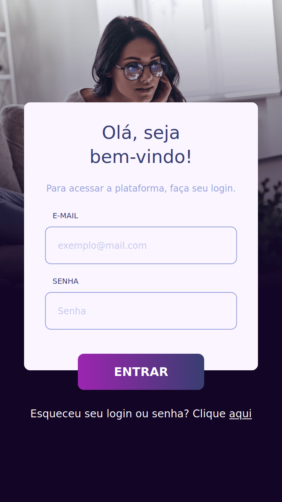

# Challenge Login - Frontend - Wiser Educação
## Objetivo
Criar uma aplicação de login, ou seja, acesso de um usuário. Com funcionamento simples: ao preencher e-mail e senha deverá ser mostrado um alerta com
sucesso ou erro. Também ter uma validação de preenchimento correto em campo de texto.
## Tecnologias obrigatórias para o desafio
- API, com [Mock API](https://www.mockapi.io​)
- Typescript
- React
- Hooks
- NextJS
- Styled Components
- Redux & Redux Saga
- Axios
## Design
[Layout](https://www.figma.com/file/zC98pMR61WhKX5joTKTMr6/Teste-Wiser?node-id=3%3A4)
## Instalação
Clone ou faça download do repositório para o seu computador.

Abra o terminal dentro do diretório do projeto e utilize um dos seguintes comandos:

```bash
npm run dev
# or
yarn dev
```

Abra [http://localhost:3000](http://localhost:3000) no seu navegador para ver o resultado.

## Como usar

Segue dados de alguns usuários **fakes** para testar a aplicação:

### Usuário #1:
- E-mail: Erik.Kihn7@hotmail.com
- Senha: WhUMwQeJZgeCWbu

### Usuário #2:
- E-mail: Kayli60@hotmail.com
- Senha: gszm0YeIuuUptlf

### Usuário #3:
- E-mail: Doris85@yahoo.com,
- Senha: 1olmEo7G8Kv34BT

## Prints - Desktop


## Print - Tablet


## Print - Mobile


## Deploy na Vercel
